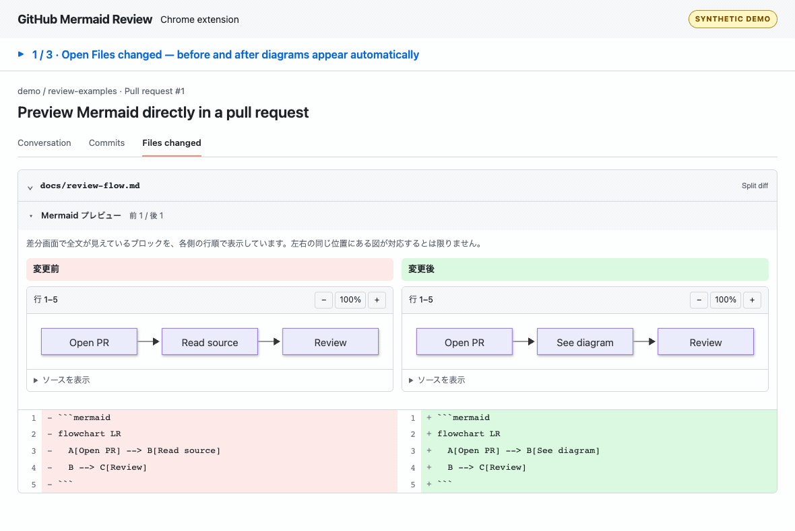
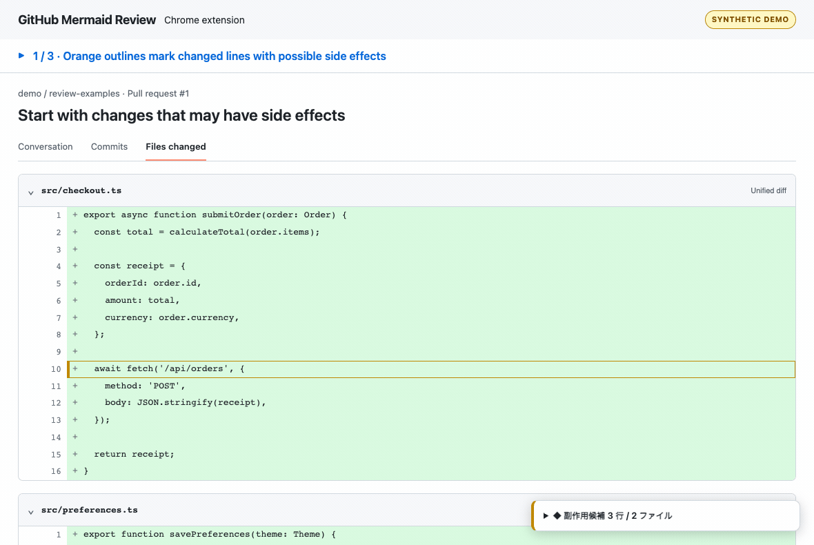

# GitHub Mermaid Review

[](https://github.com/SuguruOoki/github-mermaid-review/actions/workflows/ci.yml)
[](LICENSE)

GitHub の PR 差分で、Markdown 内の Mermaid を図として確認できる Chrome 拡張です。変更前と変更後を横に並べ、元の差分もそのまま残します！

コード差分では、副作用の候補がある変更行を強調します。画面右下の一覧から、その行へ移動できます。

**[Chrome 用 ZIP をダウンロード](https://github.com/SuguruOoki/github-mermaid-review/releases/latest/download/github-mermaid-review-chrome.zip)** · [リリース一覧](https://github.com/SuguruOoki/github-mermaid-review/releases) · [不具合を報告](https://github.com/SuguruOoki/github-mermaid-review/issues)

利用するだけなら Node.js・Git・ビルドは不要です。Chrome 120 以降が必要です。自動テストでは Chromium 153 を使っています。



GIF は再現用のサンプルコードで撮影しています。まずは次の「Chrome で使う」だけ読めば使い始められます。

## Chrome で使う

1. 上の「Chrome 用 ZIP」をダウンロードして展開します。
2. 展開した **`github-mermaid-review` フォルダ**を、残しておきたい場所に置きます。
3. Chrome のアドレスバーに `chrome://extensions` を入力します。
4. 右上の「デベロッパー モード」をオンにし、「パッケージ化されていない拡張機能を読み込む」を押します。
5. **`manifest.json` が入っているフォルダ**を選びます。展開した `github-mermaid-review` がそのフォルダです。
6. GitHub の PR で「Files changed」を開きます。すでに開いていたページは一度更新してください。

```text
github-mermaid-review/   ← Chrome で選ぶフォルダ
├── manifest.json
├── content.js
├── viewer.html
├── viewer.js
└── ...
```

Markdown ファイルの見出しの下に「Mermaid プレビュー」が出ます。図が見つかると自動で開き、画面に近づいたタイミングで描画します。各図のボタンで拡大・縮小でき、「ソースを表示」から読み取ったコードも確認できます。

読み込み後も選んだフォルダは同じ場所に残してください。移動した場合は、Chrome で移動先を読み込み直します。不要になったら、拡張機能の管理画面から無効化・削除できます。

すぐに試す場合は、公開されている [Mermaid の差分例](https://github.com/mermaid-js/mermaid/pull/8198/files) や [ファイル書き込みの差分例](https://github.com/nodejs/node/pull/50990/files) を開いてください。前者では `docs/syntax/sequenceDiagram.md`、後者では `test/parallel/test-fs-write-file-sync.js` の追加行で確認できます。

GitHub のページを読み取る権限は、表示済みの差分を解析するために使います。ソースを取得して自分でビルドする場合は、下の「開発・更新」を参照してください。

## 副作用の候補からレビューする

JavaScript・TypeScript・PHP・Python の差分を開くと、画面右下に「副作用候補」が出ます。開くとファイル別の候補行と一致した構文が並び、クリックすると該当行へ移動します。「追加」「削除」の両方を確認できます。

候補行にはオレンジの線を付けます。GitHub の追加・削除の背景色やソースは変えません。強調が不要なときは、一覧内の「候補行を強調する」をオフにできます。



分類は DB・ファイル・保存、外部通信・送信、状態変更の3つです。既知の呼び出し名や代入を手掛かりにしているため、実際に副作用が起きることや、危険な変更であることを断定するものではありません。同名の別処理・モック・メソッド宣言も候補になる場合があります。外部通信には GET も含みます。候補がなくても、副作用がないとは限りません。

読み込まれたコードを変更前・変更後それぞれで確認し、追加・削除された行だけを候補にします。コメントや文字列の中は可能な範囲で除外しますが、省略行の中で始まったコメントなどは判別できません。別名や独自のラッパーを経由する呼び出し、複数行に分かれた呼び出し、テンプレート文字列内の式、型情報による判定は対象外です。周辺行の展開や差分の読み込み後は自動で再確認します。

一覧は先頭300行まで表示し、強調は全候補に付けます。テストファイルも対象です。チェックボックスの状態はページ上だけで保持し、設定やコードを保存する処理はありません。

## 図が表示されないとき

この拡張は、差分画面に読み込まれたコードから図を作ります。開始・終了のコードフェンスと、その間の全行が必要です。GitHub の「Expand all lines」や省略行の展開ボタンで周辺行を表示すると、プレビューも自動で更新します。折りたたまれたファイルや「Load diff」が出ているファイルは、先に差分を開いてください。

構文エラーは該当する図の中に表示します。別の図は続けて描画します。空の欄は「その側で完全なブロックを読み取れなかった」という意味で、図の追加・削除を断定する表示ではありません。左右の図は各側の行順で並び、同じ位置の図が対応するとは限りません。

| 困ったこと | 確認すること |
| --- | --- |
| 拡張を読み込めない | ZIP を展開し、`manifest.json` が入っているフォルダを選びます。 |
| PR に何も表示されない | 拡張がオンになっているか確認して、GitHub の「Files changed」を再読み込みします。 |
| ファイルの差分が出ていない | 折りたたみや「Load diff」を開きます。省略行も必要に応じて展開します。 |
| 更新しても古い表示のまま | 配布ファイルを置き換え、拡張機能画面の再読み込みボタンを押してから GitHub のページも更新します。 |
| 会社の Chrome で追加できない | 管理者のポリシーでローカル拡張が制限されていないか確認します。 |

解決しない場合は [Issue](https://github.com/SuguruOoki/github-mermaid-review/issues) で、Chrome のバージョン、Unified / Split のどちらか、再現用のコード例を教えてください。非公開のコードを載せる必要はありません。

## 対応範囲

- GitHub.com の PR の `/files`・`/changes` 画面。新しい差分画面と従来の差分画面、Unified・Split 表示に対応します。
- `.md`・`.markdown`・`.mdx` 内の、言語名が `mermaid` のコードフェンス。バッククォートとチルダの両方を扱います。
- 変更前・変更後それぞれ最大 30 図、1 図あたり 50,000 文字までです。

副作用候補の対象拡張子は `.js`・`.jsx`・`.mjs`・`.cjs`・`.ts`・`.tsx`・`.mts`・`.cts`・`.php`・`.py` です。この機能も GitHub.com の PR 差分画面で使えます。

GitHub Enterprise の独自ドメイン、単独の `.mmd` ファイル、引用・リスト内にネストしたフェンス、リッチ差分表示は対象外です。通常のコードフェンス内に書かれた Mermaid の例は除外しますが、その外側の開始行が画面から完全に省略されている場合は判別できません。前後の行を展開して確認してください。

Mermaid 12.1.0 を同梱しています。GitHub 本体の描画バージョンとは一致しない場合があります。セキュリティに関わる設定、テーマの一部、HTML ラベル、図中のリンク・外部画像は制限しています。外部レイアウトなど、追加パッケージが必要な構文には対応していません。

## データの扱い

図は同梱の Mermaid でローカルに描画します。GitHub API、外部描画サービス、アクセス解析は使いません。コードや図の保存・送信処理もありません。詳しくは[プライバシーポリシー](PRIVACY.md)にまとめています。

ページ内での移動にも追従するため、スクリプトの適用先は `https://github.com/*` です。実際にプレビューを追加するのは PR 差分画面だけです。描画部分は拡張 API と GitHub の DOM にアクセスできない sandbox に分離し、外部通信を CSP で遮断しています。

## 開発・更新

実装は strict TypeScript です。開発には Node.js 24.12 以降の 24 系を使います。Node の型消去でビルドスクリプト・単体テストを実行し、拡張本体は esbuild で Chrome 用の JavaScript にまとめます。

```sh
git clone https://github.com/SuguruOoki/github-mermaid-review.git
cd github-mermaid-review
npm ci --ignore-scripts
npx playwright install chromium
npm run check
```

`npm run check` は型チェック、単体テスト、ビルド、隔離した Chromium への拡張読み込みテストを順番に実行します。普段の Chrome プロファイルはテストに使いません。ソースから利用する場合は、ビルド後にできる **`dist` フォルダ**を Chrome で読み込みます。

```sh
npm run typecheck     # strict 型チェック
npm test              # 抽出・判定の単体テスト
npm run build         # dist を生成
npm run test:browser  # Chrome 拡張としての表示・操作テスト
npm run package       # ローカル用・ストア用 ZIP と SHA256SUMS.txt を生成
npm run test:package  # ZIP を展開し、その中の拡張でブラウザテスト
```

`npm run build` の後は、Chrome の拡張機能画面でこの拡張の再読み込みボタンを押し、GitHub のページも更新してください。配布 ZIP は新しい一時フォルダでビルドし、必要なファイルだけを含めます。`dist`・テスト結果・ローカル設定は Git へ含めません。

`src/parse.ts` が Mermaid ブロックの抽出、`src/github-dom.ts` が差分の読み取り、`src/side-effects.ts` が副作用候補の判定を担当します。`src/content.ts`・`src/side-effect-ui.ts` がページへの表示、`src/viewer.ts` が図の描画です。

Chrome Web Store への提出には、`npm run package` でできる `release/github-mermaid-review-webstore.zip` を使います。`manifest.json` が ZIP の直下にある形式です。ストア用画像と掲載文は `docs/store/` にあります。スクリーンショットは `node scripts/record-demo.ts --store-screenshots` で再生成できます。

GIF を撮り直す場合は [FFmpeg](https://ffmpeg.org/download.html) をインストールして `npm run demo` を実行します。合成した差分画面で実際の拡張を操作し、`docs/assets/` の GIF を更新します。

## ライセンス

[MIT License](LICENSE) です。同梱ライブラリのライセンス表記は、配布 ZIP とビルド結果の `MERMAID-LICENSE.txt`・`THIRD-PARTY-NOTICES.txt` に含めています。

Chrome への読み込み方法は [Chrome 公式ガイド](https://developer.chrome.com/docs/extensions/get-started/tutorial/hello-world#load-unpacked)、描画の設定は [Mermaid 公式ドキュメント](https://mermaid.js.org/config/usage.html) を参照しています。
